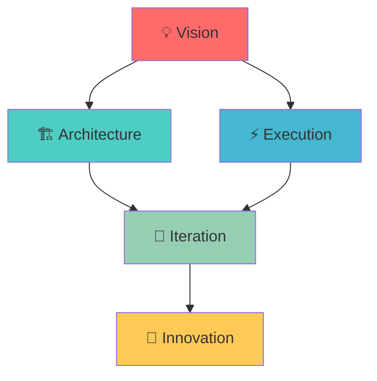

# 👨‍💻 Anshuman
### Systems-Oriented Builder & Strategic Thinker

*Hello! I'm a builder at heart, driven by a relentless curiosity to architect and optimize. My work is a reflection of a core philosophy: bridging ambitious, future-focused ideas with pragmatic, high-quality execution.*

  
  
  
  

## 🛠️ Tech Arsenal

### 🌐 Frontend Technologies

  
  
  
  
  
  

### ⚡ Backend & APIs

  
  
  
  
  
  

### 🗄️ Databases & Storage

  
  
  
  

### ☁️ Cloud & DevOps

  
  
  
  
  

### 🧰 Tools & Platforms

  
  
  
  

## 🚀 Featured Projects

<table>
<tr>
<td width="50%">

### 🛡️ AzureShield IAM
**Enterprise-Grade Identity & Access Management**

A resilient, enterprise-grade Identity and Access Management platform that moves beyond basic authentication to provide layered, dynamic, and auditable access control.

**🔥 Key Highlights:**
- 🔐 Advanced MFA & RBAC implementation
- ⚡ High-performance microservices architecture
- 🎯 Dynamic ABAC for granular permissions
- 📊 Comprehensive audit logging

**Tech Stack:** `FastAPI` `Next.js` `PostgreSQL` `Redis` `Docker` `Azure`

</td>
<td width="50%">

### 🎫 TixGenius
**High-Performance Event Ticketing Platform**

Modern ticketing application architected for performance with monorepo structure optimized for developer efficiency and scalability.

**🔥 Key Highlights:**
- ⚡ Turborepo for lightning-fast builds
- 🔄 Complete CI/CD automation
- 🏗️ Clean, decoupled architecture
- 📱 Responsive design with Tailwind

**Tech Stack:** `Next.js` `Express.js` `TypeScript` `Tailwind` `Turborepo` `Docker`

</td>
</tr>
<tr>
<td width="50%">

### 🤖 Cloud Portal CLI Assistant
**AI-Powered Developer Productivity Tool**

Revolutionary tool that bridges graphical interfaces and command-line efficiency by analyzing cloud console actions and suggesting equivalent CLI commands.

**🔥 Key Highlights:**
- 🧠 AI-powered command generation
- 🔗 Multi-layered microservices architecture
- 🌐 Browser extension integration
- ⚙️ Context-aware suggestions

**Tech Stack:** `Next.js` `Python` `Microservices` `Browser Extension` `AI/ML`

</td>
<td width="50%">

### 💼 Portfolio v2
**Interactive Digital Resume**

Rebuilt from the ground up as a polished, interactive experience showcasing modern web development practices and attention to detail.

**🔥 Key Highlights:**
- ✨ Smooth animations with Framer Motion
- 🎨 Immersive Three.js particle backgrounds
- 🌙 Dynamic theming system
- ⚡ Optimized performance with code-splitting

**Tech Stack:** `Next.js` `TypeScript` `Tailwind` `Framer Motion` `Three.js`

</td>
</tr>
</table>

<b>🔍 More Projects</b>

### 💬 Ollama Chat Demo
**Local AI Language Model Interface**

A clean, responsive chat interface for local language models, demonstrating rapid prototyping skills with emerging AI technologies.

**Features:** Model selection, chat persistence, themeable UI, local processing
**Tech Stack:** `Next.js` `NestJS` `TypeScript` `Shadcn UI` `Ollama`

## 📊 GitHub Analytics

### 🔥 Contribution Streak

### 📈 Activity Graph

## 💡 Philosophy & Approach

<table>
<tr>
<td width="33%" align="center">

### 🎯 **Strategic Thinking**
*Bridging ambitious ideas with pragmatic execution*

I don't just write code; I design systems that scale and solve real-world problems with architectural elegance.

</td>
<td width="33%" align="center">

### 🔄 **Restless Iteration**
*Continuous improvement mindset*

Every project is a learning opportunity. I believe in shipping fast, learning quickly, and iterating relentlessly.

</td>
<td width="33%" align="center">

### 🚀 **Future-Focused**
*Building for tomorrow, today*

Staying ahead of technology trends while maintaining practical, maintainable solutions that stand the test of time.

</td>
</tr>
</table>

## 🎯 Current Focus

| 🔥 **Active Projects** | 📚 **Learning** | 🎪 **Exploring** |
|:---:|:---:|:---:|
| PersonaForge.AI | Advanced AI/ML | Web3 & Blockchain |
| Microservices Architecture | Kubernetes | Edge Computing |
| DevOps Automation | System Design | Quantum Computing |

## 🤝 Let's Connect & Collaborate

### 💬 **Open to Opportunities**

I'm always looking to collaborate on meaningful projects that challenge the status quo and push technological boundaries.

  
  
  

### 🌟 **Areas of Interest**
`Full-Stack Development` • `Cloud Architecture` • `DevOps` • `AI/ML` • `System Design` • `Startup Technology`

---

*"The best way to predict the future is to create it."* - Peter Drucker

